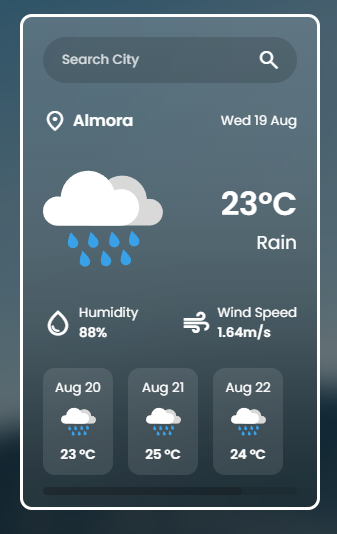

# 🌦️ Weather App

A responsive Weather App built with **HTML, CSS, and JavaScript** that fetches real-time weather data using the **OpenWeatherMap API**.

## 🚀 Live Demo

[🌦️ View Weather App](https://amritasoni-dev.github.io/Weather-API-App/)

## 📸 Preview



## ✨ Features

* 🔍 Search weather by city
* 🌡️ Current temperature
* 💧 Humidity information
* 💨 Wind speed
* 🌤️ Weather condition with dynamic weather icons
* 📅 Current date
* 📆 5-day weather forecast
* ⚠️ City not found message
* ⌨️ Search using the Enter key
* 📱 Responsive glassmorphism-style interface

## 🛠️ Technologies Used

* HTML5
* CSS3
* JavaScript
* OpenWeatherMap API
* Google Material Symbols

## 📁 Project Structure

```text
Weather-API-App/
├── index.html
├── style.css
├── script.js
├── bg.jpg
├── search-city.png
├── not-found.png
├── atmosphere.svg
├── clear.svg
├── clouds.svg
├── drizzle.svg
├── rain.svg
├── snow.svg
├── thunderstorm.svg
└── screenshot.png
```

## 🚀 How It Works

Enter a city name in the search bar and the app fetches its current weather information and 5-day forecast from the **OpenWeatherMap API**.

The app dynamically updates the temperature, weather condition, humidity, wind speed, weather icons, and forecast information based on the searched city.

## 🔑 API Key

This project uses an OpenWeatherMap API key. If you clone the project, replace the API key in `script.js` with your own API key.

> **Note:** API keys exposed in frontend JavaScript can be accessed by anyone using the application. For a production application, the API key should be protected using a backend or server-side environment variable.

## 📚 What I Learned

Through this project, I practiced:

* Working with REST APIs
* Using `fetch()`
* `async/await`
* DOM manipulation
* Event handling
* Dynamic content rendering
* Working with JSON data
* Fetching current weather and forecast data
* Dynamically changing weather icons
* Building a responsive glassmorphism-style interface

---

Built with ❤️ while learning JavaScript.
